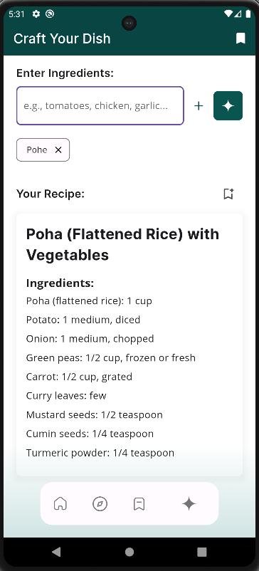

Sure! Here is the updated README file with a section for UI screenshots:

---

# CookBookAi

CookBookAi is a smart kitchen companion app that helps you generate recipes based on the ingredients you have. Utilizing the Gemini API and built with Flutter, CookBookAi offers smart suggestions and a vast library of recipes to enhance your cooking experience.

## Features

- **Ingredient-Based Recipe Generation**: Input your available ingredients, and CookBookAi will provide you with a variety of recipes you can make.
- **Smart Suggestions**: Get intelligent recipe suggestions tailored to your ingredient list.
- **Vast Recipe Library**: Access a comprehensive library of recipes to explore and try out new dishes.
- **User-Friendly Interface**: Enjoy a seamless and intuitive user experience with our Flutter-built app.

## Getting Started

### Prerequisites

To run this project, you will need the following:

- Flutter SDK
- Dart SDK
- A working internet connection to access the Gemini API

### Installation

1. **Clone the repository:**

```bash
git clone https://github.com/your-username/CookBookAi.git
cd CookBookAi
```

2. **Install dependencies:**

```bash
flutter pub get
```

3. **Run the app:**

```bash
flutter run
```

## Usage

1. **Launch the App:**
   Open the CookBookAi app on your device.

2. **Input Ingredients:**
   Enter the ingredients you have in the RecipeBuilderScreen.

3. **Generate Recipes:**
   Click the 'Generate Recipe' button to get a list of recipes you can make with your ingredients.

4. **Explore Recipes:**
   Browse through the smart suggestions and the vast library of recipes to find the perfect dish to cook.

## API Integration

CookBookAi uses the Gemini API to fetch recipe data based on the provided ingredients. Make sure to configure your API keys and endpoints in the app.

### Configuration

1. **API Keys:**
   Replace the placeholder API keys with your actual Gemini API keys in the appropriate configuration files.

2. **Endpoint Configuration:**
   Ensure the API endpoints in the app match those provided by the Gemini API documentation.

## Screenshots


*Home Screen*


*Recipe Suggestions*


*Recipe Details*

## Contributing

Contributions are welcome! If you have suggestions or improvements, feel free to submit a pull request or open an issue.

1. **Fork the repository:**

```bash
git fork https://github.com/your-username/CookBookAi.git
```

2. **Create a feature branch:**

```bash
git checkout -b feature/your-feature-name
```

3. **Commit your changes:**

```bash
git commit -m "Add your feature"
```

4. **Push to the branch:**

```bash
git push origin feature/your-feature-name
```

5. **Create a pull request:**
